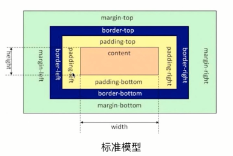

# CSS  问题答案

> 下面所有的代码都是个人作答，可能存在理解错误或者答案错误的地方，欢迎大家在[项目下方](https://github.com/springHyc/InterviewLibrary)或者[项目的 issues](https://github.com/springHyc/InterviewLibrary/issues)中留言批评指正。

## 1. 下面给出的代码你觉得有什么问题吗？

```html
<div class="container">
  <div  class="item left">left: width: 100px</div>
  <div  class="item center ">中间宽度自定义</div>
  <div  class="item right ">right width: 100px</div>
</div>

<style>
  .container {
    height: 100px;
    border: 1px solid #000;
  }
  .item {
    height: 100%;
    border: 1px solid red;
  }
  .left{
    float: left;
    width: 100px;
  }
  .center {
    margin: 0 100px;
    width: auto;
  }
  .right {
    float: right;
    width: 100px;
  }

</style>
```

> 个人答案

1.  这样实现不了三栏布局，使用 float 布局的话，中间的 div 会占一行，右侧部分会另起一行展示

2.  将中间部分和右侧部分的 html 结构换一下，就可以实现三栏布局，也就是下面这样：

```html
<div class="container">
  <div  class="item left">left: width: 100px</div>
  <div  class="item right ">right width: 100px</div>
  <div  class="item center ">中间宽度自定义</div>
</div>
```

## 2. css 选择器有哪些？

> 在 CSS 中，选择器是一种模式，用于选择需要添加样式的元素。
> "CSS" 列指示该属性是在哪个 CSS 版本中定义的。（CSS1、CSS2 还是 CSS3。）

| 选择器                                                                                            | 例子                  | 例子描述                                            | CSS |
| ------------------------------------------------------------------------------------------------- | --------------------- | --------------------------------------------------- | --- |
| [._class_](http://www.w3school.com.cn/cssref/selector_class.asp)                                  | .intro                | 选择 class="intro" 的所有元素。                     | 1   |
| [#_id_](http://www.w3school.com.cn/cssref/selector_id.asp)                                        | #firstname            | 选择 id="firstname" 的所有元素。                    | 1   |
| [\*](http://www.w3school.com.cn/cssref/selector_all.asp)                                          | \*                    | 选择所有元素。                                      | 2   |
| [_element_](http://www.w3school.com.cn/cssref/selector_element.asp)                               | p                     | 选择所有 <p> 元素。                                 | 1   |
| [_element_,_element_](http://www.w3school.com.cn/cssref/selector_element_comma.asp)               | div,p                 | 选择所有 <div> 元素和所有 <p> 元素。                | 1   |
| [_element_ _element_](http://www.w3school.com.cn/cssref/selector_element_element.asp)             | div p                 | 选择 <div> 元素内部的所有 <p> 元素。                | 1   |
| [_element_>_element_](http://www.w3school.com.cn/cssref/selector_element_gt.asp)                  | div>p                 | 选择父元素为 <div> 元素的所有 <p> 元素。            | 2   |
| [_element_+_element_](http://www.w3school.com.cn/cssref/selector_element_plus.asp)                | div+p                 | 选择紧接在 <div> 元素之后的所有 <p> 元素。          | 2   |
| [[_attribute_\]](http://www.w3school.com.cn/cssref/selector_attribute.asp)                        | [target]              | 选择带有 target 属性所有元素。                      | 2   |
| [[_attribute_=_value_\]](http://www.w3school.com.cn/cssref/selector_attribute_value.asp)          | [target=_blank]       | 选择 target="\_blank" 的所有元素。                  | 2   |
| [[_attribute_~=_value_\]](http://www.w3school.com.cn/cssref/selector_attribute_value_contain.asp) | [title~=flower]       | 选择 title 属性包含单词 "flower" 的所有元素。       | 2   |
| [[_attribute_\|=_value_\]](http://www.w3school.com.cn/cssref/selector_attribute_value_start.asp)  | [lang\|=en]           | 选择 lang 属性值以 "en" 开头的所有元素。            | 2   |
| [:link](http://www.w3school.com.cn/cssref/selector_link.asp)                                      | a:link                | 选择所有未被访问的链接。                            | 1   |
| [:visited](http://www.w3school.com.cn/cssref/selector_visited.asp)                                | a:visited             | 选择所有已被访问的链接。                            | 1   |
| [:active](http://www.w3school.com.cn/cssref/selector_active.asp)                                  | a:active              | 选择活动链接。                                      | 1   |
| [:hover](http://www.w3school.com.cn/cssref/selector_hover.asp)                                    | a:hover               | 选择鼠标指针位于其上的链接。                        | 1   |
| [:focus](http://www.w3school.com.cn/cssref/selector_focus.asp)                                    | input:focus           | 选择获得焦点的 input 元素。                         | 2   |
| [:first-letter](http://www.w3school.com.cn/cssref/selector_first-letter.asp)                      | p:first-letter        | 选择每个 <p> 元素的首字母。                         | 1   |
| [:first-line](http://www.w3school.com.cn/cssref/selector_first-line.asp)                          | p:first-line          | 选择每个 <p> 元素的首行。                           | 1   |
| [:first-child](http://www.w3school.com.cn/cssref/selector_first-child.asp)                        | p:first-child         | 选择属于父元素的第一个子元素的每个 <p> 元素。       | 2   |
| [:before](http://www.w3school.com.cn/cssref/selector_before.asp)                                  | p:before              | 在每个 <p> 元素的内容之前插入内容。                 | 2   |
| [:after](http://www.w3school.com.cn/cssref/selector_after.asp)                                    | p:after               | 在每个 <p> 元素的内容之后插入内容。                 | 2   |
| [:lang(_language_)](http://www.w3school.com.cn/cssref/selector_lang.asp)                          | p:lang(it)            | 选择带有以 "it" 开头的 lang 属性值的每个 <p> 元素。 | 2   |
| [_element1_~_element2_](http://www.w3school.com.cn/cssref/selector_gen_sibling.asp)               | p~ul                  | 选择前面有 <p> 元素的每个 <ul> 元素。               | 3   |
| [[_attribute_^=_value_\]](http://www.w3school.com.cn/cssref/selector_attr_begin.asp)              | a[src^="https"]       | 选择其 src 属性值以 "https" 开头的每个 <a> 元素。   | 3   |
| [[_attribute_$=_value_\]](http://www.w3school.com.cn/cssref/selector_attr_end.asp)                | a[src$=".pdf"]        | 选择其 src 属性以 ".pdf" 结尾的所有 <a> 元素。      | 3   |
| [[*attribute\*\*=*value\*\]](http://www.w3school.com.cn/cssref/selector_attr_contain.asp)         | a[src*="abc"]         | 选择其 src 属性中包含 "abc" 子串的每个 <a> 元素。   | 3   |
| [:first-of-type](http://www.w3school.com.cn/cssref/selector_first-of-type.asp)                    | p:first-of-type       | 选择属于其父元素的首个 <p> 元素的每个 <p> 元素。    | 3   |
| [:last-of-type](http://www.w3school.com.cn/cssref/selector_last-of-type.asp)                      | p:last-of-type        | 选择属于其父元素的最后 <p> 元素的每个 <p> 元素。    | 3   |
| [:only-of-type](http://www.w3school.com.cn/cssref/selector_only-of-type.asp)                      | p:only-of-type        | 选择属于其父元素唯一的 <p> 元素的每个 <p> 元素。    | 3   |
| [:only-child](http://www.w3school.com.cn/cssref/selector_only-child.asp)                          | p:only-child          | 选择属于其父元素的唯一子元素的每个 <p> 元素。       | 3   |
| [:nth-child(_n_)](http://www.w3school.com.cn/cssref/selector_nth-child.asp)                       | p:nth-child(2)        | 选择属于其父元素的第二个子元素的每个 <p> 元素。     | 3   |
| [:nth-last-child(_n_)](http://www.w3school.com.cn/cssref/selector_nth-last-child.asp)             | p:nth-last-child(2)   | 同上，从最后一个子元素开始计数。                    | 3   |
| [:nth-of-type(_n_)](http://www.w3school.com.cn/cssref/selector_nth-of-type.asp)                   | p:nth-of-type(2)      | 选择属于其父元素第二个 <p> 元素的每个 <p> 元素。    | 3   |
| [:nth-last-of-type(_n_)](http://www.w3school.com.cn/cssref/selector_nth-last-of-type.asp)         | p:nth-last-of-type(2) | 同上，但是从最后一个子元素开始计数。                | 3   |
| [:last-child](http://www.w3school.com.cn/cssref/selector_last-child.asp)                          | p:last-child          | 选择属于其父元素最后一个子元素每个 <p> 元素。       | 3   |
| [:root](http://www.w3school.com.cn/cssref/selector_root.asp)                                      | :root                 | 选择文档的根元素。                                  | 3   |
| [:empty](http://www.w3school.com.cn/cssref/selector_empty.asp)                                    | p:empty               | 选择没有子元素的每个 <p> 元素（包括文本节点）。     | 3   |
| [:target](http://www.w3school.com.cn/cssref/selector_target.asp)                                  | #news:target          | 选择当前活动的 #news 元素。                         | 3   |
| [:enabled](http://www.w3school.com.cn/cssref/selector_enabled.asp)                                | input:enabled         | 选择每个启用的 <input> 元素。                       | 3   |
| [:disabled](http://www.w3school.com.cn/cssref/selector_disabled.asp)                              | input:disabled        | 选择每个禁用的 <input> 元素                         | 3   |
| [:checked](http://www.w3school.com.cn/cssref/selector_checked.asp)                                | input:checked         | 选择每个被选中的 <input> 元素。                     | 3   |
| [:not(_selector_)](http://www.w3school.com.cn/cssref/selector_not.asp)                            | :not(p)               | 选择非 <p> 元素的每个元素。                         | 3   |
| [::selection](http://www.w3school.com.cn/cssref/selector_selection.asp)                           | ::selection           | 选择被用户选取的元素部分。                          | 3   |

## 3. css 盒模型是什么？

盒模型的组成：由里向外是：content、padding、border、margin。

盒模型有两种标准：一个 w3c 标准模型，一个是 IE 模型。




从上面两图不难看出在标准模型中，盒模型的宽高只是内容（content）的宽高，

而在 IE 模型中盒模型的宽高是内容(content)+填充(padding)+边框(border)的总宽高。

## 4. 实现 div 的动画移动

使用 css3 的动画 animation 和@keyframes 来实现 div 的移动。

```html
<html>
<head>
  <style>
    div {
      width: 100px;
      height: 100px;
      border: 1px solid red;
      position: relative;
      animation: div 5s  infinite alternate;
    }

    @keyframes div {
      form {left: 0; background-color:'#fff'}
      to {left: 200px; background-color: red}
    }
  </style>
</head>

<body>
  <div></div>
</body>
</html
```

## 5. css 模块化是什么？

css 模块化就是所有的类名都只有局部作用域的 css 文件。

> 好处
> css 模块化将作用域限制于组件中，从而避免了全局作用域的问题，编译过程还能帮你完成命名。

> css 模块化的解决方案
> 目前解决方案有两种:
> 第一，彻底抛弃 css,使用 js 或 json 来写样式，例如：[Radium](https://github.com/FormidableLabs/radium)，[jsxstyle](https://github.com/smyte/jsxstyle)，[react-style](https://github.com/js-next/react-style) 属于这一类。
> 第二, 依旧使用旧的 css,使用 js 来管理样式依赖，代表是[css-modules](https://github.com/css-modules/css-modules)

## 6. 如何实现一个三列布局，中间固定，两边自适应？

```js
<header>
  <style>
    .contaniner {
      display: flex;
      flex-direction: row;
      justify-content: space-between;
    }

    .item {
      border: 1px solid red;
      height: 100%;
    }

    .center {
      width: 100px;
    }

    .left,
    .right {
      width: calc(50% - 50px);
    }
  </style>
</header>
<div class="contaniner">
  <div class="item left">
    left
  </div>
  <div class="item center">
    中间
  </div>
  <div class="item right">
    右边
  </div>
</div>
```

> 相对应的问题来了，如何实现一个三栏布局，中间自适应，两边固定？

> 只需要把中间和两边的宽度调整一下即可。
>
> ```js
>    .center {
>      width: calc(100% - 200px);
>
> }
>
>    .left,
>    .right {
>      width: 100px;
>    }
> ```

## 7. 通过 html img 标签设置图片和通过 div 背景图设置图片，两种设置图片的方式有什么优劣？

- 占位符
  `` 标签定义 HTML 页面中的图像。从技术上讲，图片并不会插入 HTML 页面中，而是链接到 HTML 页面上。img 标签的作用是为被引用的图像创建占位符。

  background-image 作为背景，在图片没有加载的时候或者加载失败的时候，不会有图片的占位标记，不会出现红叉。

- 加载时间
  `img`是写在 HTML 里的是以 HTML 插入 img 标签的形式存在，CSS 图片背景是等结构加载完成后再去加载的。
- 是否为内容
  非内容的图片写在 css 里，内容的图片就写在 HTML 里。

## 8. 实现一下一个 div 的居中。如果不适用 flex 布局怎么做？

> 以前整理的文件中有

## 8. 实现一下一个 div 的居中。如果不适用 flex 布局怎么做？

```js
<header>
  <style>
    .contaniner {
      margin: 0 auto; // 左右居中
      border: 1px solid red;
      width: 100px;
      height: 100px;
      top: calc(50% - 50px);
      position: relative;
    }
  </style>
</header>
<div class="contaniner" />
```

> 必须有 width,`margin: 0 auto`才有效果；
> `top: calc(50% - 50px); position: relative;`是可以上下居中

## 9. 普通的实现一下两个`<div>`横着排列？

```js
<header>
  <style>
    .contaniner {
      height: 100%;
      width: 100%;
    }

    .item {
      border: 1px solid red;
      width: 100px;
      height: 100px;
      float: left;
    }
  </style>
</header>

<div class="contaniner">
  <div class="item"></div>
  <div class="item"></div>
</div>
```
