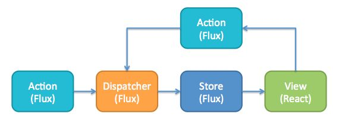

# 项目经验的问题答案

> 下面所有的代码都是个人作答，可能存在理解错误或者答案错误的地方，欢迎大家在[项目下方](https://github.com/springHyc/InterviewLibrary)或者[项目的 issues](https://github.com/springHyc/InterviewLibrary/issues)中留言指正。

## 1. angular 和 react(react-native) 的区别？

> react-native 是把 react 那一套的底层换成 ios 和 Android app 的底层，让你能用开发网页的方法来开发原生 APP。

- 从库的大小上来说，angularjs 属于重量级的，而 react 和 react-native 都属于轻量级的。
- 从数据处理方面来说，angularjs 是双向绑定的双向数据流方式，也会带来性能问题，angular 的实现方法叫做“Dirty-checking”（脏检查机制），也就是通过跟踪数据的改变再动态更新 UI 界面。所以意味着在 angular 的作用域中任何操作的执行都会引发 Dirty-checking，随着绑定数量的增加性能就会降低；而 react 和 react-native 是单向绑定的单向数据流方式。
- 从操作 DOM 方面来讲，angular 过于依赖 DOM，angular 在执行过程中会先扫描所有的 DOM，然后通过指令来编译（angular 是直接操作 DOM）。这会造成一个结果，就是很难去判断程序的执行顺序导致很难进行调试；react 是有一个“虚拟 DOM”,并不直接对 DOM 进行操作，在页面渲染的过程中，react 通过虚拟 DOM 中的微操作来实现对实际 DOM 的局部更新。
- 从组件化的角度来说，angular1.x 没有大规模的组件形式，angular2 才是大规模的组件化的形式；react && react-native 是可以编写独立的 UI 组件。
- 从描述 UI 外观方面来说,angular 使用的就是 html，react 使用的是 jsx,jsx 是 JavaScript 的语法扩展，通过 Java 实现的类 XML 语言。jsx 不遵循内容与逻辑分离的传统方法。但是它有一个明显的又是：静态分析。如果 jsx 标记中有错误，编辑器会报错，这个能帮助我们立即发现拼写错误和其他一个愚蠢的错误。
- 从新手入门学习的成本方面来说，angular 的学习成本比 react&&react-native 更大些。angular 要了解更多的概念：type、模块、依赖注入、装饰器、组件、服务、管道、模板和指令以及高级一些的如 RxJs;而 react&&react-native 来说，我们需要了解的概念有：jsx、组件，高级一些的有 redux。

react 相比 angular 的优点：

- react 的性能很好，虚拟 DOM，不直接对 DOM 进行操作，可以满足实际生产环境下绝大部分的性能要求。
- 从使用者的角度来说，是非常轻量级的。很容易和其他顺手的工具搭配使用。而 angular 是重量级，里面的一些部分是直接继承在 angular 的源码中的，比如路由导航部分。

- angular 比较重量级，多一些开箱即用的特性，而 react 的特性不多，可以根据自己的需求去选择合适的第三方库。

- React 快速的原因之一就是 React 很少直接操作 DOM，浏览器时间也一样，原因是太多的浏览器时间会占用很大的内存。
- React 本身只是 view 层，它提供了一套编写 DOM 组件的工具，提出了 virtual dom(虚拟 DOM)这种新颖的思路，并且衍生出了 react native.

## 2. 单项数据流和双向数据流区别？

> 经常看见在 vue 或者 angular 的介绍里说自己的特色是双向数据绑定，而在看 react 的介绍中，说自己的优势和特色是单向数据绑定。 这两个截然不同的机制，为什么又都能自圆其说呢？在同一个时代里怎么建立统一的理解？还是说两种机制有各自适合的最佳场景？

一般来说，非 UI 控件不存在双向的，只有单向数据流。UI 控件才有双向的数据流问题。

单项绑定使得数据流也是单向的，对于复杂应用来说这是实施统一的状态管理（如 redux）的前提。

双向绑定在一些需要实时反应用户输入的场合会非常方便（eg. 多级联动菜单）。但通常认为复杂应用中这种便利比不上引入状态管理带来的优势。

## 二者的差异

### 原理

**双向数据绑定和单向数据绑定的差异在于：双向数据绑定是把数据变更的操作隐藏的框架内部，调用者并不会直接感知。**

单向绑定相对应的似的数据流也是单向的，而在践行单向数据流的 flux 的设计框架（redux 是其一个具体实现）中实现中，其实不过是在全局搞了一个单例的事件分发器（dispatcher）,开发者必须显示的通过这个统一的时间机制来做数据变更通知。

其实这种方式跟框架对 UI 控件上实现双向绑定的方式是一样的。**底层都是事件机制**。

> 假设在双向绑定的应用中，我们有办法 hack 进框架对 UI 控件 自动绑定的事件 listener 或 数据 watcher，然后加上类似 dispatcher 的逻辑，双向绑定背后的状态变化我们一样可以管理起来，一样可以享用单向数据流才有的收益。

> 单向绑定中如果我们做进一步的封装，把 action 和 dispatcher 都隐藏在框架内部，最后就变成。如果再进一步，把相互手动通知机制再隐藏起来，就变成sx

其实单双向绑定在一定程度上来说是可以转化的。只不过是框架封装程度上的差异，本质是可以相互转化的。

### 优缺点

#### 单向绑定

##### 优点

- 单向绑定可以相应的带来单向数据流，这样的好处是所有的状态变化都是可以被记录、跟踪，状态变化通过手动调用通知，源头易追溯，没有“暗箱操作”。
- 组件数据只有唯一的入口和出口，使得程序更加直观更容易理解，有利于应用的可维护性。

##### 缺点

- 代码量会相应的上升，数据的流转过程变长，从而出现很多类似的样板代码。
- 由于对应用状态独立管理的严格要求（单一的全局 store）,在处理局部状态较多的场景时，会显得啰嗦以及繁琐。

#### 双向绑定

##### 优点

- 在表单交互较多的情况下，会简化大量业务无关的代码。

##### 缺点

- 由于都是“暗箱操作”，我们无法追踪局部状态的变化（虽然大部分情况下我们并不关心），潜在的行为太多也增加了出错时 debug 的难度。
- 由于组件数据变化来源入口变的可能不止一个，新手很容易将数据流转方向弄的紊乱，如果再缺乏一些“管制”手段，最后就很容易一处错误操作造成应用雪崩。

### 适用场景

由以上的优缺点，我们可以得出单向绑定和双向绑定在功能上基本是互补的。

在 UI 控件中（通常是类表单操作），我们会使用双向的方式绑定数据；而其他场景则统一采用单向的方式构建应用。

## 3. ng 和 react 的脚手架有什么？

### angular 的脚手架

- Visual Studio Code
- angular-cli
- ionic-cli
- tyscript

### react-native 的脚手架

- Visual Studio Code
- Prettier
- EditorConfig
- ESlint
- Flow
- jest
- react devtools
- reactotron
- remote-redux-devtools
- redux
- redux-saga
- reselect
- react-navigation
- apisauce

## MVC 模式

所谓 MVC 开发模式，主要讲的是在开发交互应用时，怎么将不同功能的代码拆分到不同的文件或区块，以便降低代码的耦合度，提高代码的可读性和健壮性。

MVC 来源于服务器端的开发。前端开发中也引入了 MVC 的概念。（Model-View-Controller）

- Model
  前端开发的 Model 相当于后台数据的镜像或缓存池，它和服务器端 MVC 中的 Model 概念一脉相承；
- View
  View 对应页面的呈现，主要指的是和 HTML、CSS 相关的代码，它和服务器端 MVC 中的 View 概念也非常相近；
- Controller
  在前端应用中，用户和网页之间的交互主要是通过操作事件（例如点击鼠标、键盘输入等）实现的，所以前端的 controller 这里可以简单理解为各种交互事件的 handler。
  > 前端 controller 的概念比较杂，比如 angularjs 中的 controller 被定义为一个作用域（`$scope`）的闭包，这个闭包可以和一段 HTML 模板绑定在一起，最终将数据渲染到模板中形成页面。

## react, flux 和 redux 的关系？

简单来说：

Flux 本身是一套单项数据流的设计框架。
Redux 是其中的一种具体实现。
React 和 redux 总是一起出现，是因为如果单单使用 react，它仅仅是一个 view 的框架，不足以提供足够的前端管理和使用功能。而 redux 的引用就好像 react+MC 一样，赋予了 react 完整的生态系统。当然 redux 不是基于 mvc 的。简单说，redux+react 换了个更直接的法子实现了 MVC 能提供的数据管理功能。

## 4. ReactNative 中调用手机的相机，是怎么个调用，是 rn -> react -> 原生，还是 rn->原生? JSBridge 用过吗？

## 5. ReactNative 中 APP 的自动更新？有两种方式。

## 6. 为什么从 angular 转到 react-native 架构？

## 7. 遇到的 react-native 本身的性能问题有什么？

## 8. react 的生命周期，在哪个生命周期中设置 setState 不会引起重新渲染？

| 生命周期                  | 调用次数        | 能否使用 setSate() |
| ------------------------- | --------------- | ------------------ |
| getDefaultProps           | 1(全局调用一次) | 否                 |
| getInitialState           | 1               | 否                 |
| componentWillMount        | 1               | 是                 |
| render                    | >=1             | 否                 |
| componentDidMount         | 1               | 是                 |
| componentWillReceiveProps | >=0             | 是                 |
| shouldComponentUpdate     | >=0             | 否                 |
| componentWillUpdate       | >=0             | 否                 |
| componentDidUpdate        | >=0             | 否                 |
| componentWillUnmount      | 1               | 否                 |

## 9. react 项目中的`registerServiceWorker.js`文件是做什么的？

在生产中，我们注册一个服务工作者来从本地缓存服务资产。
这使得应用程序在以后的产品访问中加载速度更快，并使其具备离线功能。但是，这也意味着开发人员(和用户)将只看到在“N+1”访问页面时部署的更新，因为以前缓存的资源在后台更新。

也就是实现 PWA。
